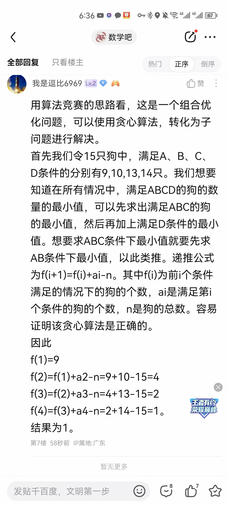
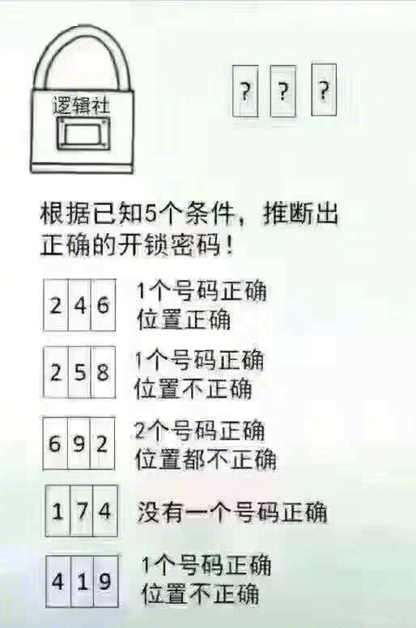
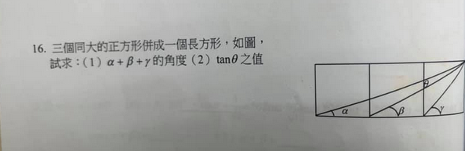
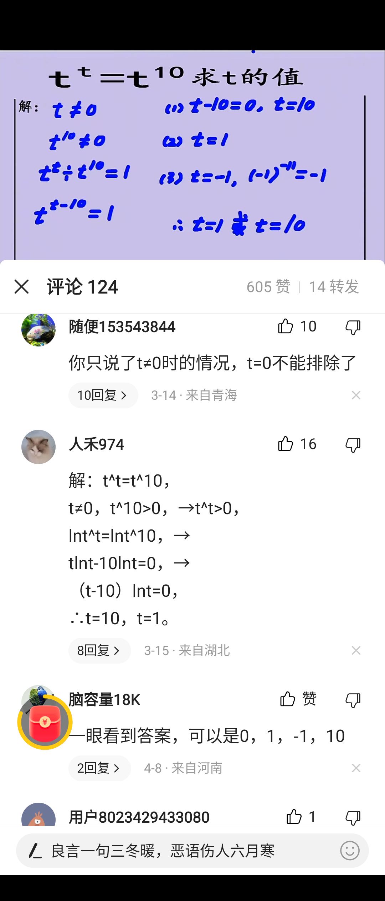
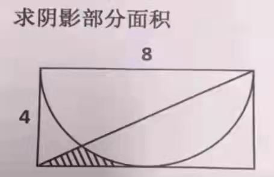
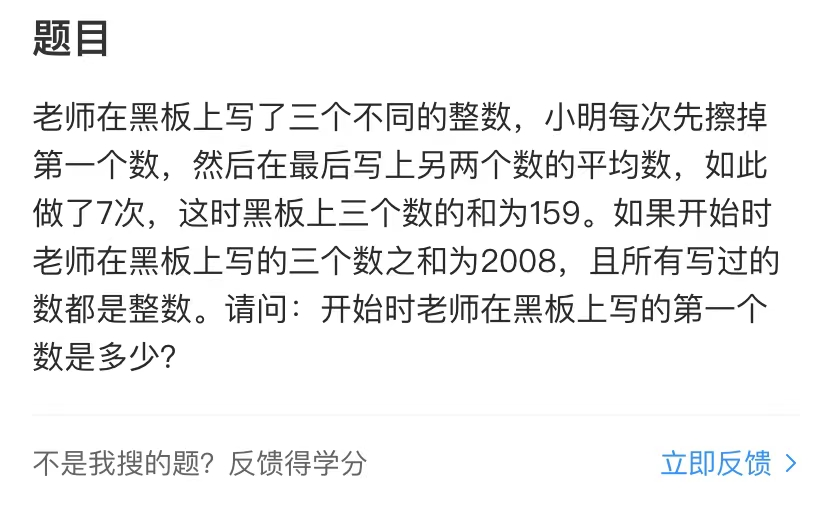
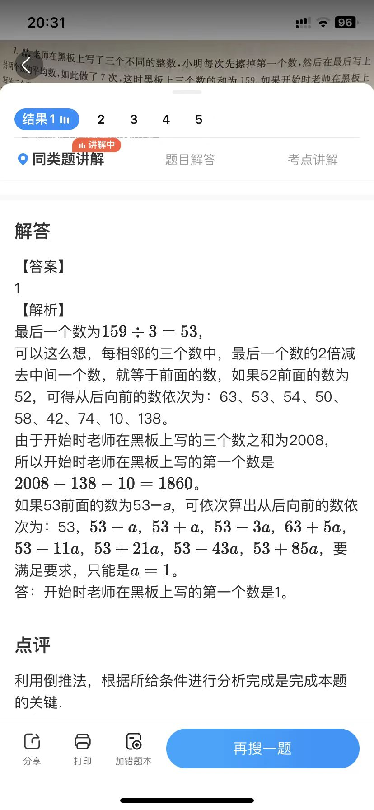
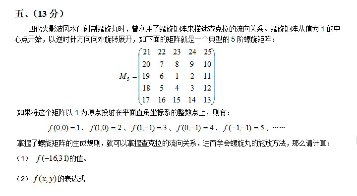
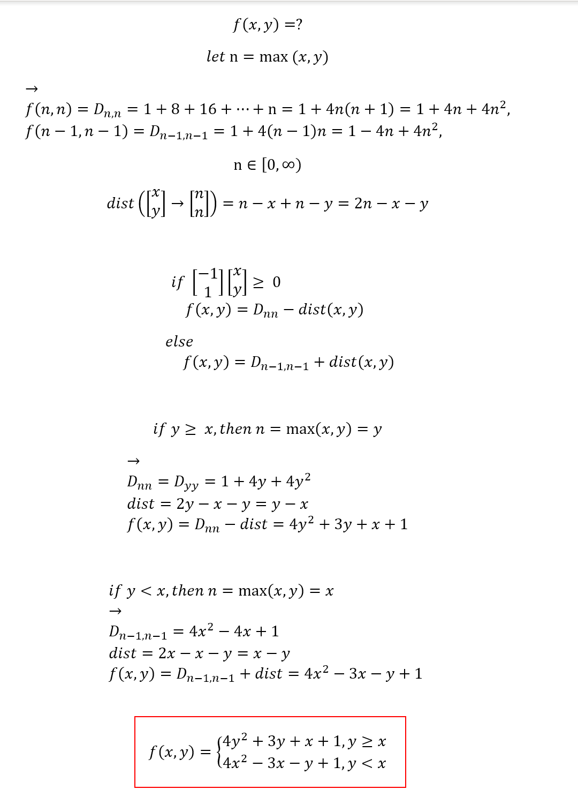

# Mathematics Relevant Article Collection
数学相关文集

 

- [数学中函数的演变简史](https://www.toutiao.com/a6705366854317113869)
- [世界七大数学难题有哪些？](https://www.toutiao.com/a6754967053989315085/)
- [一文概括数学的各个研究领域](https://www.toutiao.com/a6814711162341425664/)
- [数学史上的三次危机，都和这个字有关](https://www.toutiao.com/a6781606502818906635/)
- [法国数学到底有多厉害？](https://www.toutiao.com/article/6937980358763856391/)
- [2021年数学和计算机的6大突破](https://www.toutiao.com/i7047055233297646112/)
- [数学运算和它们的逆运算](https://www.toutiao.com/a6753424503109321223/)
- [我引以为豪的数学，被娃用新加坡数学打败了](https://www.toutiao.com/a6755745696411812355/)
- [葛立恒数有没有10的80次方大？](https://wukong.toutiao.com/question/6482900802745663758/)
- [‘0.99999…’真的等于‘1’吗？数学所面临的更深层次的哲学挑战](https://www.toutiao.com/i7061122272928612903/)
- [复数是如何被发现的？数学家们为何如此痴迷的研究了500年](https://www.toutiao.com/a6765767297387725324/)
- [我们的世界为什么会需要复数？](https://www.toutiao.com/i7059147245782041088/)
- [虚数到底有什么意义？从 i 说起](https://mp.weixin.qq.com/s?__biz=MzA4NDI3MjgyMw==&mid=2448232973&idx=6&sn=766ebbf1febac7b0847d9398fe814991&chksm=8bf001d5bc8788c3b558a1e14433ecba285daef35ad632a2b44e5c91483def7a221ce73843b6&scene=27)
- [发现250年毫无进展！为什么虚数不在数轴上？](https://www.toutiao.com/video/7152089496510136868/)
- [根号i等于多少？](https://www.toutiao.com/video/7050654717298508301/)
- [人机交互和复分析](https://www.toutiao.com/article/7381258881407713804/)
- [傅立叶分析之掐死教程](http://zhuanlan.zhihu.com/wille/19763358)
- [傅里叶变换是什么？来看最直观的傅里叶变换图解](https://www.toutiao.com/video/7275647045866769703/)
- [终于，有人能讲明白傅里叶变换了](https://www.toutiao.com/article/7141223292031025704/)
- [傅里叶变换，有史以来最伟大的数学发现之一，理解其背后的直觉](https://baijiahao.baidu.com/s?id=1711309753031579562)
- [傅里叶变换交互式入门](https://www.jezzamon.com/fourier/zh-cn.html)
- [Theano中使用FFT甚至能获得更快的卷积](http://benanne.github.io/2014/05/12/fft-convolutions-in-theano.html)
- [离散余弦变换](http://blog.csdn.net/luoweifu/article/details/8214959)
- [信号的自相关](https://www.toutiao.com/a6820477114291061251/)
- [数字信号处理中均值、方差、均方值、均方差计算和它们的物理意义](https://blog.csdn.net/wordwarwordwar/article/details/63251674)
- [快速傅里叶变换](https://blog.csdn.net/u012531536/article/details/82530285)
- [【拉普拉斯变换】这样理解才直观#拉普拉斯变换](https://www.toutiao.com/video/7295679437964659983/)
- [频谱为什么会泄漏？](https://www.toutiao.com/a6788812208227746317/)
- [函数y=arctan(-7x-21)+x的多阶导数计算步骤](https://www.toutiao.com/article/7365423978879812108/)
- [传奇谢幕：88岁MIT教授的最后一堂线性代数课](https://www.toutiao.com/article/7233667874995405372/)
- [带你一文了解零知识证明](https://www.toutiao.com/i6891957348949197319/)
- [蒙特卡洛马尔可夫链学习小结](https://www.toutiao.com/a6822456838559105540/)
- [使用最广泛的状态估计算法-扩展卡尔曼滤波的数学原理思想及C代码](https://www.toutiao.com/article/7308632644391109158/)
- [压缩下一个 token 通向超过人类的智能](https://zhuanlan.zhihu.com/p/619511222)
- [一 篇 谁 看 谁 疯 的 SCI](https://mp.weixin.qq.com/s?__biz=MzA4OTYxNzE4NQ==&mid=2649426442&idx=1&sn=a9784d961f2315ae6c6921b13c6d24fa)
- [浅谈常见的几种CFD算法](https://mp.weixin.qq.com/s?__biz=MzA4NzI1NjE0Nw==&mid=2649751534&idx=1&sn=83598fa9cc506829d83659297c2d5ae7)
- [“向量”的前世今生：8位天才数学家，耗时2000年完成](https://www.toutiao.com/a6768308525685801479/)
- [拉格朗日方程与哈密顿原理，终极的自然原则，宇宙的主要动力](https://www.toutiao.com/i6930450409148531208/)
- [硬核科普——不确定性原理本质上与量子力学无关，而是纯数学现象](https://www.toutiao.com/i7011097155792388641/)
- 如何证明乘法交换律：首先确立ab的意思为b个a，ba的意思为a个b，假设ab都为正整数，将b个a（ab）纵向列出来，也就是每一横排写上一个a，共1列，再将a分解为基本单位1+1+1+.....写在横排，共a列。我们再把每一列相加，结果为1\*b（b个1），一共a列，所以总和为1\*b\*a（a个1\*b），即ab=1ba，根据正整数b的定义可以理解b为b个1，所以1\*b=b，得出结论:ab=ba。自己总结出的另一种超简洁证明方法：假设a\*b表示为一个矩形的面积，那么当把该矩形旋转90度便为b\*a的面积，两者显然相等。
- [你知道a+b=b+a该如何证明吗？方法可能没有你想象的那么简单](https://www.toutiao.com/a6784292768177979907/)
- [三角形内角和定理的几种证明方法](https://wenku.baidu.com/aggs/60e3ec0f76c66137ee061915.html)
- [二项式定理](https://www.baidu.com/sf_bk/item/二项式定理/7134359?fr=kg_general&ms=1&rid=8135676937993314684)
- [数学写真：用几何图形解读数学公式的本质原理](https://www.toutiao.com/a6788685978279084552/)
- [自然界最美丽的十个公式](https://www.toutiao.com/i6521720051660227075/)
- [理解了源和旋，你就理解了麦克斯韦方程组](https://www.toutiao.com/i7046381794106540576/)
- [学姐分享40组超炫数学动图，瞬间开启你的数学思维，速来转发收藏](https://www.toutiao.com/i6733839996874129933/)
- [如何不用微积分算个球？](https://www.toutiao.com/a6721927900490105348)
- [微分和导数的关系是什么？两者的几何意义有什么不同？为什么要定义微分 ?](https://www.zhihu.com/question/22199657/answer/115178055)
- [用微积分计算1到100连续自然数平方之和](https://www.toutiao.com/a6877898925915931148/)
- [上凸下凸的极致——琴生不等式](https://www.toutiao.com/i6507718197184037389/)
- [帮忙解一下这题，写一下过程。（求解几何级数极限之和）](https://zhidao.baidu.com/question/684479831404203652.html)
- [圆周角定理](https://baike.baidu.com/item/圆周角定理/5943980?fr=aladdin)
- [围棋中的数学原理（二）](https://www.toutiao.com/i7026934990902559262/)
- [数学的深渊](https://blog.csdn.net/weixin_33725239/article/details/85945715)
- [数学史》-数学原来很有趣](https://www.toutiao.com/i6691595619607249419/)
- [10大反直觉的数学结论](https://www.toutiao.com/a6730184150155788813/)
- [史上最贱的数学题](https://mp.weixin.qq.com/s?__biz=MzA5ODUxOTA5Mg==&mid=2652579879&idx=1&sn=7f37ed74b8180eb4a4d345debc8b1ba6&chksm=8b7fd97cbc08506a18bcbcf0f7f37cfad04f1edef92c2f68a72d6d15a4d0fe92380590ebcb86&mpshare=1&scene=23&srcid=0202hahRh3yzjZptYMHm5HOm)
- [常数e是个什么玩意](https://www.toutiao.com/i6499422938532413965/)
- [π + e =？](https://www.toutiao.com/a6742442475337564684/)
- [伯努利是如何将自然数任意次幂之和系统化的？](https://www.toutiao.com/a6790535053307806221/)
- [数学家花了2千年也没能定义好“平面”，最后希尔伯特处理得巧妙](https://www.toutiao.com/i6711057574323552772/)
- [数学之王欧拉有多强？发现最美数学公式，给圆周率取名为π](https://www.toutiao.com/a6741894903627792908/)
- [最伟大的数学公式：欧拉公式](https://www.toutiao.com/i6700367309506085387/)
- [漫谈黎曼几何，揭秘高维空间的数学骨架，远比你想的简单。](https://kuaibao.qq.com/s/20190826AZNXFE00?refer=spider)
- [数学建模常用模型](https://www.toutiao.com/article/7287132448373506571/)
- [Interactive Linear Algebra](https://textbooks.math.gatech.edu/ila/)
- [12页线性代数笔记登GitHub热榜，还获得了Gilbert Strang大神亲笔题词](https://zhuanlan.zhihu.com/p/642594871)
- [这是一份文科生都能看懂的线性代数简介](https://www.toutiao.com/i6539110935561241096/)
- [麻省理工线性代数笔记（一）-线性方程组表示方式](https://zhuanlan.zhihu.com/p/36524700)
- [【机器学习】线性代数-特殊矩阵](https://www.toutiao.com/article/7238784250366214671/)
- [什么是张量 (tensor)？](https://www.zhihu.com/tardis/bd/ans/447498656)
- [证明：不等式ex≥x+1](https://www.toutiao.com/a6793264784268591628/)
- [线性代数之——向量简介](https://zhuanlan.zhihu.com/p/49813419)
- [原来数学才是世界上最浪漫的学科！看完还能再写三套题](https://www.toutiao.com/a6744319640047976971/)
- [算24全分析：计算力最强的牌组是哪个？最好算的数字是哪个？](https://www.toutiao.com/i6893097169281090052/)
- [如此烧脑的题目你会做几道？](https://www.toutiao.com/a6738169966979187208/)
- [一个数学问题彻底改变了我对数学的看法](https://www.toutiao.com/i7007050543105507878/)
- [据说是中科大少年班的选拔考试题](https://www.toutiao.com/w/i1712066961504256/)
- [爸爸，你把这种题拿给我做，你是不是太高估我了](https://www.toutiao.com/w/i1713399588955140/)
- [题目是:有一牧场，已知养羊27头，6天把草吃尽；养羊23头，9天把草吃尽。如果养羊21头，那么几天能把牧场上的草吃尽呢？并且牧场上的草是不断生长的。](https://www.toutiao.com/w/i1720886294543360/)
- [题目：如图所示，在大直角三角形中，分成两个直角三角形和一个正方形，求阴影部分的面积](https://www.toutiao.com/w/i1721536828350467/)
- [5道小学奥数题难倒众人，大人看到答案后，普遍怀疑自己的智商！](https://www.toutiao.com/i6630652584564638211/)
- [陈稻酿新酒——如何用小学知识证明三线相等](https://www.toutiao.com/i7044110012897182220/)
- [新加坡小学数学题难倒一片](https://www.toutiao.com/i7015026999689216548/)
- [上海幼升小题目家长考题答案 应为公务员形测图形推理](https://news.duote.com/53/156067.html)
- [小学奥数（几何）](https://www.toutiao.com/i7015753769665217024/)
- [上海某校奥数班题。头条数学大神们，看看这题怎么做](https://www.toutiao.com/w/i1713328467436574/)
- [请用小学六年级的知识解答本题](https://www.toutiao.com/a1665838666647555/)
- [微信群里一道六年级数学题，求阴影面积，那我只能用python代码了](https://www.toutiao.com/a6830001478329958916/)
- [小学数学：谁发明了这几张动图，原来几何这么简单！](https://www.toutiao.com/a6739027876785439236/)
- [这4道小学数学题，老师看了抓狂，家长看了揪头发，学霸能全做对](https://www.toutiao.com/i6659367826341495307/)
- [一道小学数学竞赛题难度不小，求正方形面积，要有很强的推理能力](https://www.toutiao.com/a6742377779532136974/)
- [五年级几何压轴题，已知长方形ABCD的面积为36平方厘米，点E在AD上，且AD=3AE，连接CE，点F、G是CE的三等分点，求阴影部分的面积？](https://www.toutiao.com/w/i1721435298646020/)
- 小学5年级的培优的题目——马戏团驯养了15只狗。其中14只会表演翻筋斗，13只会表演倒立，9只会表演钻圈，10只会做算术。请问，至少有几只狗都会表演？

群友回答：

> 这里面有一个不会翻，两个不会倒立，6个不会钻，5个不会算数，所以最多有1+2+6+5个狗不能全能，所以至少有一个全能。\
14只会翻筋斗，那也就是说有1只可能啥都会但是就是不会翻筋斗。其他三项同理，那么相减的后得到的数字就是其他几项都会，但是就是不会A的，然后要求4项全会的至少数值，那就是这四项之间互不相交，所以四个数值最大的并集就是14，因此最少只有1只狗四项都会。

网上解答参考：

- [我特别讨厌让小学生做太多这种题，简直就是坑娃。学了初中一线三等角构造全等三角形，就简单多了。](https://www.toutiao.com/w/i1721126946664448/)
- [一道奥数题，让你学会解更复杂的裂项求和试题，看完就会](https://www.toutiao.com/a6751288937135735304/)
- [求两个小正方形面积之和，让小学生一筹莫展，家长：我也不会啊](https://www.toutiao.com/a6744586873995280908/)
- [这道小学数学思考题难倒众人，若能发现图中隐含条件则可瞬间解决](https://www.toutiao.com/a6745331023334081028/)
- [这道思考题看起来似乎缺条件，看完解答过程让人赞叹辅助线的奇妙](https://www.toutiao.com/a6746084790564291084/)
- [一道北京海淀某名校的入学题：学生抱怨缺少条件，使90%的人丢了这10分！985家长尝试做下也直摇头，表示这题太烧脑了！](https://www.toutiao.com/w/i1717578491225176/)
- [动动脑，想一想，这个图形中有多少个三角形？](https://www.toutiao.com/a6746087183788016131/)
- [智力题：脑子不聪明，至少得花上半小时](https://www.toutiao.com/a6751534432093471246/)
- [智力测试：7题对5个智商高！可居然有人一个都做不出来](https://www.toutiao.com/a6824284336846537228/)
- [新加坡老师怎么教数学？](https://www.toutiao.com/i7052616828656894475/)
- [小学生11道智力题，能答对5题，智商一定不得了](https://www.toutiao.com/a6753394945211499021/)
- [小学生循序渐进学奥数（四年级）](https://www.toutiao.com/a6754636196229415431/)
- [题目如下：正方形里有一个直角三角形，它的边长分别是3,4，求正方形的面积](https://www.toutiao.com/w/i1714147118108718)
- [蜀道难不及此题难](https://www.toutiao.com/w/i1713743981298695/)
- [网友：我可能没有读过小学，求答案？](https://www.toutiao.com/a1664185511961614/)
- [求解，杠了俩小时了，没算出来,脑仁疼](https://www.toutiao.com/a1664374301472807/)
- [题目：如图，在正方形ABCD内，有四个以正方形边为半径的四分之一圆，若已知正方形边长为1，求中间阴影部分的面积。](https://www.toutiao.com/w/i1722734697887759/)
- [一起看题，条件:如图所示，在直角三角形ABC中，∠B=90度，∠CAD=45度，AD=13，AB=12，求线段CD的长度？](https://www.toutiao.com/w/i1721929418805278/)
- [如图：矩形ABCD中，AB=4，BC=3，点E为AB边上一动点，以DE为边向右作正方形DEFG，连接CF，求CF的最小值？](https://www.toutiao.com/w/i1722345304560647/)
- [一道初中数学奥赛题让学生毫无办法，看了解答过程后大呼想不到](https://www.toutiao.com/a6725678761393537539)
- [这是一道【魔都某著名实验中学】的一道期末考试题](https://www.toutiao.com/w/i1713398502739981/)
- [决战2022年中考数学重难点解题方法，高效突破几何辅助线添加技巧](https://www.toutiao.com/i7050341130164011550/)
- [初中数学三角形中14种辅助线添加方法，掌握后再也不怕这类题目了](https://www.toutiao.com/a6748961171040109060/)
- [题目:如图所示，直角三角形里，有三个正方形，其中两个小的面积分别是4cm²和9cm²。求大正方形面积。](https://www.toutiao.com/w/i1721462674275335/)
- [一道初中数学竞赛题，很多人看完题后感觉简单，但做对者寥寥无几](https://www.toutiao.com/a6737569676479431172)
- [一道初中几何题，费了我一个月时间，终于解出来了](https://www.toutiao.com/i7048042306578088486/)
- [等腰直角三角形的特殊性，一道让我想了2天的初中几何题](https://www.toutiao.com/i7048871127375938087/)
- [条件如图，在三角形ABC中，∠A=2∠C，已知AC=10厘米，AB=6厘米，求线段BC的长度？](https://www.toutiao.com/w/i1721348695931944/)
- [如图，正方形ABCD, E是DC上中点，F.G在AC上，∠GEF=45°，AF=3，CG=4，求GF长](https://www.toutiao.com/w/i1721270869176334/)
- [我初一看，首先想到用tan2α与tanα的关系，但是这是初中题目，用高中知识自然不行](https://www.toutiao.com/w/i1721087781532680/)
- [这是一道比较有意思的初中数学题](https://www.toutiao.com/w/i1720493372569604/)
- [从“手拉手模型”到“脚拉脚模型”看理科老师的无耻、堕落与脱轨](https://www.toutiao.com/i7047447294387782175/)
- [正方形ABCD中有一矩形EFGH，点F刚好是BC的中点，点E、G分别在AB、AD上，已知EF=4，求FG的长](https://www.toutiao.com/w/i1709599294433309/)
- [如图，五边形ABCDE内接圆，其中四边形BCDE是满足BC=DE=1的长方形，若AB=EA=6，请问圆的直径是多少？](https://www.toutiao.com/w/i1723239419028493/)
- [这本是一道八年级数学几何题，我现在把他改成9年级题目，让9年级孩子们用9年级圆的知识点来做，谁知道，没一个会的，真的懵了。如图，AB是圆O的直径，E，D分别是半圆上的两点，且EG⊥AB，DC⊥AB，DF⊥EO，求证：EG=CF。](https://www.toutiao.com/w/i1721194620869644/)
- [证明ABCD是正方形 想挺久没想出来](https://www.toutiao.com/w/i1710207041742855/)
- [几何基本功一招搞定三角形二倍角问题 - 初中数学联赛几何100题之12](https://www.toutiao.com/i7051875650776482312/)
- [题目：如图，在一个半径未知的圆里面，有一个内接四边形，边长分别为7、8、10、11，求这个四边形的面积](https://www.toutiao.com/w/i1721001722283023/)
- [这是上海最厉害高中的一道自招数学压轴题](https://www.toutiao.com/w/i1719989925367820/)
- [突然很火的预防老年痴呆题讲解，浅浅模仿一下数学老师（对不起）](https://www.bilibili.com/video/BV1jX4y1e7fB/)
- [日本市川中学的一道几何练习题，日文原题见附图，中文翻译如下，一个正五边形和矩形的组合图形，求标注的2角角度之和。](https://www.toutiao.com/w/1734445506538564/)
- [求解一元二次方程式不再繁琐！美国数学博士发现简便新方法](https://www.toutiao.com/i6768720850230182403/)
- [旋转构造几何最值](https://www.toutiao.com/i6507734563395994120/)
- [超级好题推荐！](https://www.toutiao.com/w/i1720356936800269/)
- [移动两颗瓜子，使等式成立？女大学生只需3秒，当场录取](https://www.toutiao.com/i6737051646838178317/)
- [现在孩子很不简单,移动3个使头朝下，2分钟交卷！](https://www.ixigua.com/6901699521206551052/)
- [计划教育下的数学教育之怪现状](https://www.toutiao.com/a6830706569085190671/)
- [图形推理100道(附答案)](https://wenku.baidu.com/view/06554eb7312b3169a551a469)
- [韦神封神一战 IMO竞赛题](https://www.toutiao.com/video/7284100153579998498/)

 

 

 

 

 

此题答案：[利用Python求阴影部分的面积实例代码](https://www.jb51.net/article/152050.htm)

 

 

 

## 关于“不想当将军的士兵不是好士兵”这个命题的逻辑分析

一天，营长在全营会上讲话说：“不想到将军的士兵不是好士兵”，那么营长讲这句话的意思是：

A：想当将军的士兵一定是好士兵        B： 除非想当将军，否则不是个好士兵

C：坏士兵是不想当将军的                D：坏士兵也是想当将军的

E：不想当将军的士兵，也可以是一个好士兵

 

对于原话，我们可以将这一命题转化为一个复合命题，使得能够通过两个子命题与整命题的关系来判定下面5个命题哪个是与原命题是完全相符的——“如果一个士兵不想当将军，那么他就不是好士兵”。注意原命题是一个陈述句，只是提到了不想当将军的情况，而没有提到想当将军的情况，因此不能将原命题转为：“一个士兵不是一个好士兵，当且仅当他不想当将军”，或“一个士兵只有想当将军，才是一个好士兵”。因此，原命题只能转为一个包含一个表示蕴含关系的联结词的复合命题。

这样，就有了两个原子命题——“一个士兵不想当将军”和“一个士兵不是一个好士兵”。我们后面为了描述方便，采用数理逻辑中的表达方式，将命题“一个士兵不想当将军”作为命题A，而将命题“一个士兵不是一个好士兵”作为命题B，那么原命题就是——A -> B

符号->表示“蕴含”联结词，字面上的语义就是“如果……那么……”。我们通过A、B两个原子命题的真假值可以获得原命题的真假值。倘若，下面的5个命题的与A、B两个原子命题所等价的原子命题的所有的值能够得到与原命题相同的结果，那么我们称它们为等价的。

对于蕴含关系，原子命题与整命题的关系为：A -> B，表示A蕴含B，其在数理逻辑的真值表为：
- 0 -> 0 = 1，表示命题A为假，且命题B为假，那么整个命题为真
- 0 -> 1 = 1，表示命题A为假，且命题B为真，那么整个命题为真
- 1 -> 0 = 0，表示命题A为真，且命题B为假，那么整个命题为假
- 1 -> 1 = 1，表示命题A为真，且命题B为真，那么整个命题为真

下面我们来看选项A——“想当将军的士兵一定是好士兵”。在命题逻辑里面，像“一定”这种副词没任何作用，完全可以拿掉，那么这句话的意思就是——“如果一个士兵想当将军，那么这个士兵就是个好士兵”。同样，我们用原子命题X表示“一个士兵想当将军”，用原子命题Y表示“这个士兵是个好士兵”。我们这里可以看到，命题X的关系与命题A完全相反；命题Y的关系与命题B也完全相反，我们可以表示为：命题A = ~命题X；命题B = ~命题Y。那么我们可以这么描述这个命题：

\~A -> \~B，表示 \~A 蕴含 \~B，其在数理逻辑中的真值表为：
- 0 -> 0 = 1
- 0 -> 1 = 0
- 1 -> 0 = 1
- 1 -> 1 = 1

显然，这个选项的命题与原命题不符。

我们再看看选项B——“除非想当将军，否则就不是个好士兵”。由“除非”所引出的条件是必要条件，表示对由“否则”所引出的命题做出断言——“不想当将军的士兵不是好士兵”。因此，这句在汉语的语义上与原命题是相兼容的。

选项C——“坏士兵是不想当将军的”。这个命题的结构与原命题一样，可以转义为——“如果一个士兵不是一个好士兵，那么这个士兵不想当将军”。其实这个命题就表示成了B -> A。

这个很容易判断，真值表中的第2、3项与原真值表的值恰好相反，所以与原命题不符。

选项D——“坏士兵也是想当将军的”，这个命题显然与原命题显然不符。

选项E——“不想当将军的士兵，也可以是一个好士兵”。这其实是一个带有表示存在量词的谓词逻辑。但是我们从一般语义上分析可以得出，这个命题其实是“掏江湖”的。由于不管原子命题是否为真，整个命题都一定为真。因此与原命题不符～

